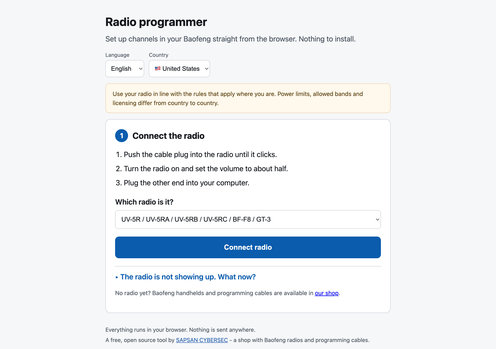

# Radio Programmer

Set up channels in a Baofeng handheld from your browser. No Python, no CHIRP install, no driver CD
from 2011.

**Use it now: [radio.sapsan-sklep.pl](https://radio.sapsan-sklep.pl)** - nothing to install.



> **Status: works on real hardware. Full cycle - read, edit, write, verify - tested on a Baofeng
> UV-82 on macOS and Windows 11. Windows 7 (Chrome 109) verified through read and backup. The
> write path follows CHIRP's clone protocol.**

## Why this exists

[CHIRP](https://chirpmyradio.com) is excellent and supports about a hundred radios. It is also a
desktop app that wants a Python runtime, and it presents you with a spreadsheet. Someone who just
unboxed their first handheld does not want a memory editor - they want the radio to have channels
in it.

So: pick your country, tick the sets you want, adjust the list if you feel like it, write.

## How it works

Web Serial API. The browser opens the port at 9600 8N1, sends the handshake, reads the radio's
memory in 64-byte blocks, we swap the channel area and write it back in 16-byte blocks.

**No backend.** Everything runs locally. Your radio's contents never leave the machine.

### Requirements

- A Chromium-based browser: Chrome, Edge, Opera, Brave. Firefox and Safari do not implement Web Serial.
- A Kenwood-plug programming cable.
- **A working driver for the cable's USB chip.** Web Serial can only see ports the operating system
  already exposes - that is not something a web page can work around. See [Drivers](#drivers).

## Supported radios

One protocol family covers:

`UV-5R` · `UV-5RA` · `UV-5RB` · `UV-5RC` · `UV-82` · `UV-82HP` · `BF-F8` · `GT-3` · `UV-6R` · `P15UV` · `BF-A58`

You pick the model from a list rather than having the tool guess. That is deliberate - see
[What the hardware taught us](#what-the-hardware-taught-us).

## Countries and languages

The interface starts in **English**; Polish, German and Czech are one click away.

Frequency sets are filtered by country so the list stays useful:

| Country | Sets |
|---|---|
| 🇺🇸 United States | FRS/GMRS (22), MURS (5), 2 m and 70 cm per ARRL |
| 🇵🇱 Poland | PMR446, LPD433, PMR-154, IARU R1 bands, **emergency services** |
| 🇩🇪 Germany | PMR446, LPD433, Freenet (6), IARU R1 bands |
| 🇨🇿 Czechia | PMR446, LPD433, IARU R1 bands |

### Polish emergency services

Picking Poland reveals a third selector: **place**. Police, fire, ambulance and municipal guard
channels are assigned to specific towns, so without one the list would be meaningless. The data
covers **416 towns and provinces**, plus nationwide sets: numbered fire service channels (53),
marine VHF (90), railway (37), border guard (41), crisis management (56), state forests (13) and
mountain/water rescue (30).

The data is extracted by `tools/parse_sluzby.py` and `tools/build_sluzby.py`, never retyped by
hand. The source has two traps that the scripts work around: a `num=` attribute in the HTML that
does **not** match the displayed value (leftover from an Excel export), and header rows carrying
band edges that look exactly like channels.

## The channel sheet

Chosen sets are a starting point, not the final word. Before writing you get an editable list: add
your own frequency, rename anything, set a CTCSS tone for a repeater, drop channels you do not
need, or clear it and build from scratch.

The frequency field accepts both `145.500` and `145,500`. Names are trimmed to 7 characters and
upper-cased as you type, because that is what the radio's display will show. A frequency outside
the radio's bands is flagged - **but does not block the write**. That call is yours, not ours.

## Safety

**The backup is mandatory.** The write button stays disabled until you have downloaded a copy of
what is currently in the radio.

**Restore works too.** The restore panel is visible from the moment you connect, not buried at the
end of the wizard - whoever reaches for it usually already has a problem. Files are validated
before being sent: wrong size, or contents that do not match the UV-5R layout, stops the operation.

**Only the channel area is written**, not the whole memory. Radio settings stay untouched, and the
auxiliary region from `0x1EC0` (band limits, power-on message) is never even read.

**Writes are verified by reading back.** The radio acknowledges every block, but an ACK means
"received", not "stored correctly". A failed read-back is reported differently from a mismatch -
those are two different situations.

Closing the tab mid-write triggers a browser warning.

## What the hardware taught us

Measured on a physical Baofeng UV-82 over a CH340 cable, 2026-07-28. Full cycle passed: read →
write PMR446 → read back → restore backup → read back. The restored image matched the backup byte
for byte. Reading 6144 bytes takes ~8 s, writing ~13 s.

Four findings, all now in the code:

- **The radio ignores a handshake sent immediately after the port opens.** It needs a moment to
  settle first (`PORT_SETTLE_MS`).
- **DTR and RTS must both be asserted.** Any other combination and the radio stays silent. Web
  Serial asserts them by default, so browsers get this for free.
- **A radio that receives the wrong handshake goes quiet for a good fifteen seconds.** Neither
  waiting nor reopening the port after a second brings it back, while sending only the correct
  sequence works every time. That is why **the user picks the model** instead of us probing a list
  - probing turned out to be both slower and unreliable.
- **After a write the radio ends the session and will not answer a read straight away.**
  Verification needs the port closed for ~4 s (`RECONNECT_PAUSE_MS`); one second is not enough.

## Drivers

This is the part no web page can fix, so here it is plainly.

| System | CH340 | Notes |
|---|---|---|
| **Linux** | in-kernel (`ch341`) for many years | works out of the box |
| **macOS** | built in since 10.14 | a manufacturer driver, once installed, claims the device and takes over from the built-in one |
| **Windows 10/11** | inconsistent | sometimes a stale driver is pulled in, sometimes none at all |
| **Windows 7** | never installed automatically | the cable sits in Device Manager under "Other devices" as **USB Serial** with a yellow mark (Code 28), and the browser's port picker shows only the motherboard's empty COM1 - which looks exactly like a broken app. Install `CH341SER` from WCH, replug, done |
| **Prolific PL2303 (counterfeit)** | deliberately blocked by the vendor | not fixable from our side |

WebUSB would let a page bypass the OS driver, but it does not support CH340 or CP2102 - the very
chips these cables use. So "no drivers needed" would be a half-truth, and we do not print it.

## Running it

```bash
npm install
npm run dev      # dev server
npm test         # protocol and data tests against a fake radio, no hardware needed
npm run build    # production build
```

## Hardware tools

Same protocol code as the browser, different transport - useful for debugging without a UI:

```bash
node --experimental-strip-types tools/hw-test.ts             # read only
node --experimental-strip-types tools/hw-test.ts --write      # full cycle incl. write
node --experimental-strip-types tools/hw-restore.ts file.img  # restore a backup
python3 tools/radio_probe.py                                  # no-Node probe, read only
```

`hw-test.ts` refuses to overwrite an existing backup file: on a second run the radio already holds
the test channels, and saving those as "the backup" would destroy the only way back.

## Layout

```
src/radio/uv5r-memory.ts    memory map, channel and name encoding
src/radio/uv5r-protocol.ts  serial protocol: handshake, read, write, verify
src/radio/web-serial.ts     Web Serial transport
src/data/bands.ts           frequency sets grouped by country
src/data/services.ts        Polish emergency services, local and national
src/data/services-pl.json   generated by tools/ - do not edit by hand
src/ui/sheet.ts             channel sheet: editing and input validation
src/ui/                     the wizard, four screens
test/fake-radio.ts          a fake radio - full cycle without plugging anything in
tools/                      data extraction and hardware scripts
```

### A note for contributors

Tests run under `node --experimental-strip-types`, which does **not** parse TypeScript parameter
properties (`constructor(private readonly x: T) {}`). One of those anywhere in the import graph
kills the whole test file with `ERR_UNSUPPORTED_TYPESCRIPT_SYNTAX` before a single test runs.
Declare fields explicitly.

## Not in scope

Radio settings (squelch, VOX, backlight, timeout and several dozen other fields - CHIRP has fifteen
years and a community that tested those across a hundred models), firmware flashing, DMR, user
accounts.

Also missing: amateur repeaters per city, and emergency services outside Poland. Those need a data
source of the same quality as the Polish one.

## Data sources

PMR446, LPD433, PMR-154 and all Polish services - [czestotliwosci.pl.tl](https://czestotliwosci.pl.tl).
Freenet - BNetzA. FRS/GMRS and MURS - FCC via RadioReference. Amateur bands - IARU Region 1 and
ARRL band plans.

## Credits and licence

The memory layout and serial protocol were worked out from CHIRP's `chirp/drivers/uv5r.py`. Without
that work this project could not exist.

Licensed **GPL-3.0**, same as CHIRP.

---

Built by [SAPSAN](https://sapsan-sklep.pl), a Polish shop selling the radios this tool programs.
